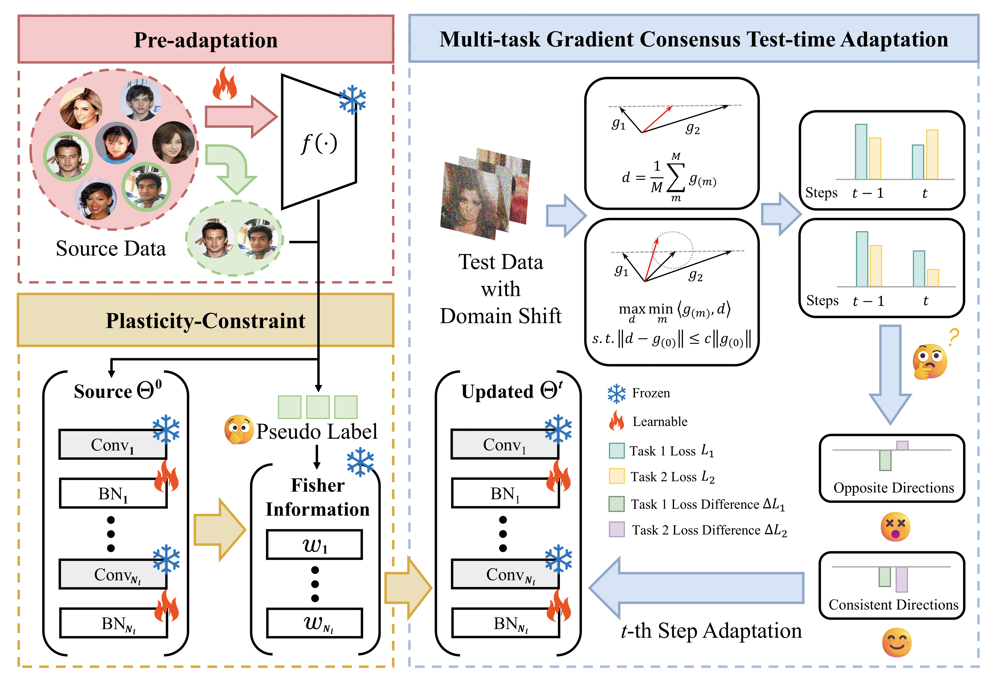

<p align="right">
  <a href="README.md">English</a> | <strong>中文</strong>
</p>

# 多任务测试时域适应
多任务测试时域适应 (MT-TTA) 旨在使得多任务预训练模型在进行测试/推理时, 通过对没有标签的样本即可良好地适应环境的动态变化.



## 环境配置
Python Version: 3.10.13; CUDA Version: 12.8

| torch      | 2.7.0+cu118 | pypi_0 | pypi |
|------------|-------------|--------|------|
| torchaudio | 2.7.0+cu118 | pypi_0 | pypi |
| torchvision| 0.22.0+cu118| pypi_0 | pypi |

Tips: 请确保 Torch 相关库和 CUDA 版本互相兼容

创建 conda 虚拟环境 MT_TTA
```bash
conda env create -f environment.yml -n MT_TTA
```

## 数据集

### 数据集获取
[CelebA](https://mmlab.ie.cuhk.edu.hk/projects/CelebA.html) 和 [PlantData](https://pan.baidu.com/s/1wPhu7GjyMinLeDJbKGbFPw?pwd=kukn), 其基于 [PlantVillage](https://github.com/spMohanty/PlantVillage-Dataset) and [Rice Plant Disease Dataset](https://github.com/MHassaanButt/Rice-Disease-Classfication) 构建, 详情请见附录.

| 数据集     |   总数  |  训练集  | 测试集 | 任务数 |
|------------|---------|-------- |--------| ----- |
| CelebA     | 202,599 | 141,819 | 60,780 |   4   |
| PlantData  | 19,219  | 13,453  |  5,766 |   3   |

### 数据集处理
请将数据集置于 /Datasets 文件夹下, 参考格式如下:

## 多任务测试时域适应算法的使用

### M-TENT/EATA/SAR/CoCo
1. 修改 Output file's name 以及存放路径 (33 line and 35 line)
2. 选择适应的目标数据集 (搜索 'create_celeba' 和 'create_plantdata')
3. 选择域适应算法, 如下所示进行对应的修改
4. 执行脚本 python main.py
Tips: 可命令行直接指定超参数选择, 也可直接修改 utils.py 中的 Hyper-parameters Controller

**M-TENT**
(1) 将 PC 相关内容注释掉 (62 and 63 lines)
(2) 将 grad_adjust_fn 置为 None
(3) 将 require_fishers 置为 False

**M-EATA**
(1) 确保 PC 相关内容正确, 没有被注释掉 (62 and 63 lines)
(2) 将 coco_model = CoCo(...) 换为
```python
eata_model = EATA_MultiTask(mymodel, optimizer, fishers=fishers, fisher_alpha=args.PC_alpha, steps=1, episodic=False, d_margin=0.05)
```
(3) 将 coco_model 替换为 eata_model

**M-SAR**
(1) 将 PC 相关内容注释掉 (62 and 63 lines)
(2) 将 coco_model = CoCo(...) 换为
```python
sar_model = SAR_MultiTask(mymodel, optimizer, steps=1, episodic=False)
```
(3) 将 coco_model 替换为 sar_model

**CoCo**
(1) 确保 PC 相关内容正确, 没有被注释掉 (62 and 63 lines)
(2) 将 grad_adjust_fn 置为 gradient_consensus
(3) 将 require_fishers 置为 True
Tips: 可直接参考 main.py 脚本


### M-ActMAD
1. 修改 Output file's name 以及存放路径 (340 line and 346 line)
2. 选择适应的目标数据集 (PlantData: 362-364 lines; CelebA: 367~369 lines)
3. 执行脚本 python M-ActMAD.py
- Tips: 请根据步骤 2, 选择 task names (343 or 344 line)


# 联系
欢迎通过 zhongye0312 [at] gmail.com 联系 Zhong Ye 📬.

# 引用
如果我们的工作对您的研究有所帮助, 请考虑进行引用:
